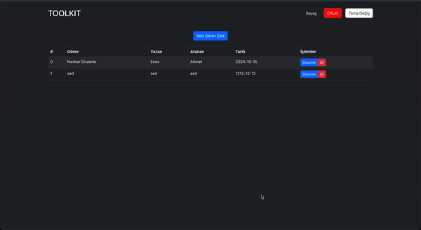

## React Toolkit Basics
This project includes counter app and add task. You can add a task, organise a task and delete a task.

## Technologies Used

- **React**: Frontend library for building UI components.
- **Redux**: Manages the global state of the application.
- **Redux Thunk**: Middleware for handling async logic in Redux.
- **React Router DOM**: Enables client-side routing.

- **uuid**: For generating unique IDs for cart items.

- **React Toolkit**: Basic state management.

- **Bootstrap**: For styling  and responsive design

